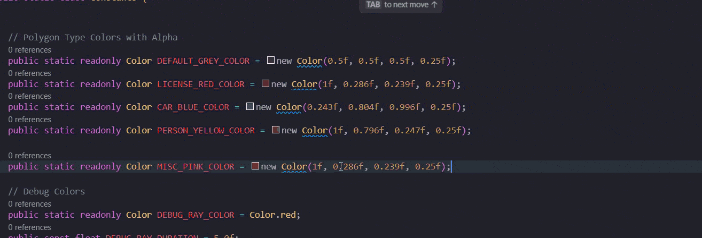

## Unity Color Preview

[](https://marketplace.visualstudio.com/items?itemName=clock-worked.vscode-unity-color-preview)
[](https://marketplace.visualstudio.com/items?itemName=clock-worked.vscode-unity-color-preview)
[](https://marketplace.visualstudio.com/items?itemName=clock-worked.vscode-unity-color-preview)
[](https://open-vsx.org/extension/clock-worked/vscode-unity-color-preview)

Inline color previews for Unity's `Color` and `Color32` constructors in C# with configurable highlighting and named color support.



### Features

- **Inline color swatches** for occurrences of:
  - `new Color(r, g, b)` or `new Color(r, g, b, a)` where values are floats in \[0, 1\]
  - `new Color32(r, g, b)` or `new Color32(r, g, b, a)` where values are bytes in \[0, 255\]
  - Named Unity colors like `Color.red`, `Color.white`, `Color.clear`, etc.
- **Configurable color highlighting** with background or underline styles
- **Quick replace presentations** to switch between `Color` and `Color32` forms
- **Customizable presentation preferences** and precision settings

### Demo

Type code like this in a C# file:

```csharp
var tint = new UnityEngine.Color(0.75f, 0.25f, 0.5f, 0.8f);
var ui = new UnityEngine.Color32(128, 64, 255, 200);
var primary = Color.red;
var transparent = Color.clear;
```

You will see color decorations inline and can use the color picker to edit:


### Color Highlighting

Enable highlighting to see colors directly in your code:


### Requirements

- VS Code ≥ 1.85.0

### Extension Settings

This extension contributes the following settings:

| Setting | Description | Default |
|---------|-------------|---------|
| `unityColorPreview.showHighlightColor` | Highlight occurrences with the detected color as background or underline | `false` |
| `unityColorPreview.highlightOpacity` | Opacity of the highlight overlay when highlighting colors (0-1) | `0.25` |
| `unityColorPreview.highlightStyle` | Rendering style for highlights: background fill or underline | `background` |
| `unityColorPreview.showOverviewRulerColor` | Show color marks in the editor overview ruler for detected colors | `false` |
| `unityColorPreview.preferredFormat` | Preferred constructor format in the quick color presentations | `Color` |
| `unityColorPreview.floatPrecision` | Number of decimal places for float components in Color presentations (0-6) | `3` |
| `unityColorPreview.includeAlphaByDefault` | List alpha-including presentations before non-alpha ones | `true` |
| `unityColorPreview.enableNamedColors` | Detect and preview named colors like Color.red, Color.white, Color.clear | `true` |

### Configuration Examples

**Enable color highlighting with custom opacity:**
```json
{
  "unityColorPreview.showHighlightColor": true,
  "unityColorPreview.highlightOpacity": 0.3,
  "unityColorPreview.highlightStyle": "background"
}
```

**Use Color32 as preferred format with higher precision:**
```json
{
  "unityColorPreview.preferredFormat": "Color32",
  "unityColorPreview.floatPrecision": 4,
  "unityColorPreview.includeAlphaByDefault": false
}
```

**Disable named colors and overview ruler:**
```json
{
  "unityColorPreview.enableNamedColors": false,
  "unityColorPreview.showOverviewRulerColor": false
}
```

### Known Issues

- Does not parse variables or expressions, only direct constructor literals.

### Release Notes

See [`CHANGELOG.md`](./CHANGELOG.md).

### Contributing

Contributions welcome! See [`CONTRIBUTING.md`](./CONTRIBUTING.md).

### License

MIT © Clockworked — see [`LICENSE`](./LICENSE)


